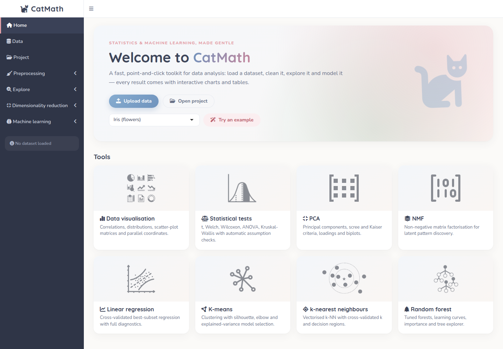
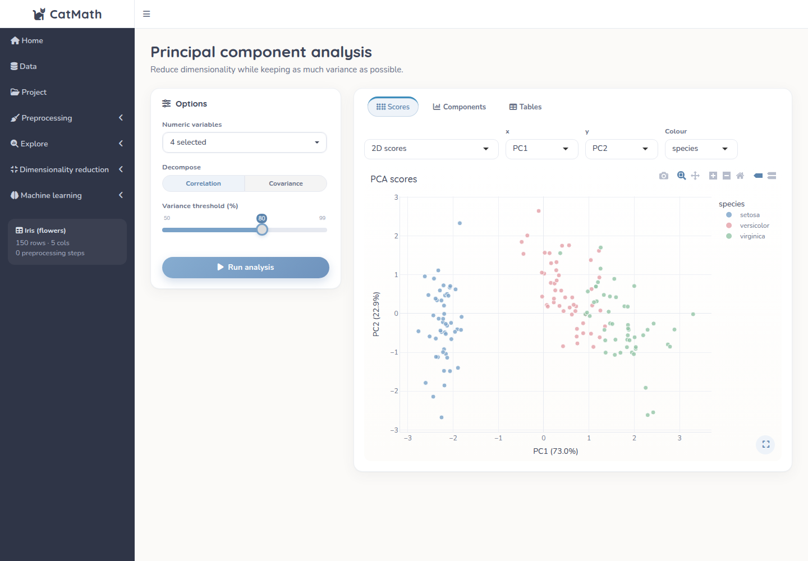
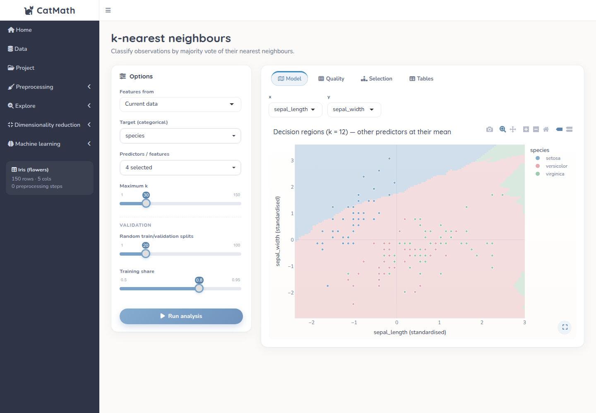

# CatMath

**CatMath** is a point-and-click statistics and machine-learning app written in R/Shiny.
Load a dataset, clean it, explore it and model it: every analysis has its options on the
left and its output — interactive charts and tables — on the right, in the spirit of JASP.



## Features

| Area | Tools |
|------|-------|
| **Data** | CSV/TSV/TXT upload (fast multi-threaded parser), example datasets, numeric and categorical summaries |
| **Preprocessing** | Feature selection with correlation filter · regex find & replace · row aggregation by group · sparse-variable removal · type conversion · missing-data handling (remove, mean, median, constant, MICE) · z-score, min-max, sqrt, log transforms · step history and one-click reset |
| **Exploration** | Correlation matrix, box/violin, density, histogram, scatter-plot matrix, parallel coordinates, category frequencies, missing-value map — all live, no "run" needed |
| **Statistical tests** | Automatic choice between Student/Welch t-test and Wilcoxon, Fisher F and Brown–Forsythe, ANOVA/Welch ANOVA and Kruskal–Wallis, with Benjamini–Hochberg adjusted p-values |
| **Dimensionality reduction** | PCA (scores 2D/3D, biplot, scree, Kaiser, cumulative variance, loadings) · NMF (NNDSVD initialisation, explained variance by rank, W/H heatmaps) |
| **Machine learning** | Linear regression with cross-validated best-subset selection and diagnostics · K-means with silhouette/elbow model selection · k-NN with decision regions · random forest with tuning grid, learning curves, importance and tree explorer |
| **Projects** | Save/restore the whole session (data, history, results) as a compact `.rds` file |

Machine-learning tools can use the raw variables or the PCA/NMF components as features.

| PCA | k-NN |
|-----|------|
|  |  |

## Getting started

Requires R ≥ 4.1.

```r
source("install.R")   # installs the required packages once
shiny::runApp()       # from the repository folder
```

## Project structure

```
app.R                    entry point (Shiny sources R/ automatically)
R/
  config.R               palette, fonts, computational limits
  utils.R                small shared helpers
  data_io.R              file reading and descriptive summaries
  analysis_*.R           pure computation (no Shiny): preprocessing, tests, PCA/NMF, models
  plot_*.R               plotly charts built from analysis results
  ui_components.R        reusable layout blocks (cards, result tabs, zoomable plots, tables)
  app_state.R            shared reactive state
  mod_*.R                one Shiny module per page
  app_ui.R, app_server.R top-level wiring
www/                     theme (catmath.css) and images
data/                    example datasets
tests/testthat/          unit tests for the computation layer
```

The computation layer never touches Shiny, so every `run_*()` function can be used
directly from an R script:

```r
source_files <- list.files("R", full.names = TRUE); invisible(lapply(source_files, source))
df  <- read_example("iris.csv")
fit <- run_knn(df, vars = numeric_vars(df), target = "species", k_max = 20)
fit$k; fit$cv_accuracy
plot_confusion(fit$confusion)
```

## Performance notes

* **k-NN** – distances computed block-wise with one matrix product, neighbours sorted once
  and votes for *every* k obtained with cumulative sums (≈35× faster than fitting one model per k).
* **Random forest** – one forest per (mtry, split); smaller forests are evaluated by predicting
  with the first *n* trees, so the tree-count grid needs no extra training.
* **Regression** – all subsets are scored on the same splits with `lm.fit` on a pre-built design
  matrix (≈13× faster); forward selection is used above 12 predictors.
* **K-means** – the silhouette distance matrix is computed once (on a sample for large data) and
  the best run of every K is kept, so any K can be inspected without re-running.
* **NMF** – native vectorised multiplicative updates with deterministic NNDSVD start.
* **Charts** are built lazily: only the chart on screen is computed, and project files store
  results rather than rendered figures.

Run the test suite with:

```r
testthat::test_dir("tests/testthat")
```

## Example data

* *Iris* — R `datasets` package.
* *Titanic* — passenger survival data.
* *Mice protein expression* — Higuera, Gardiner & Cios (2015), UCI Machine Learning Repository (CC BY 4.0).

## License

[MIT](LICENSE)
